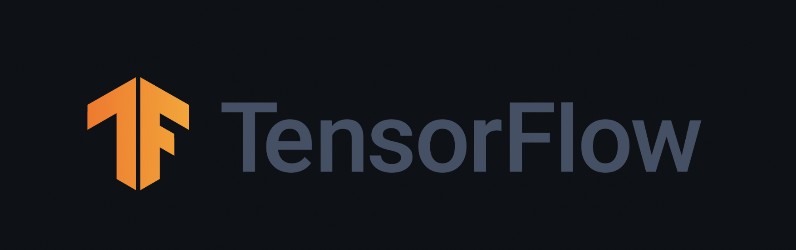
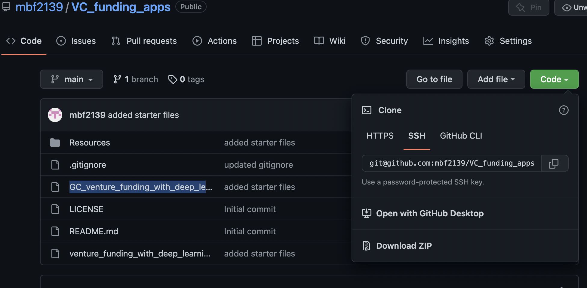

# VC_funding_apps
ML analysis for venture capital 

# credit_risk_resample
credit analysis for loan applications 

---
## Technologies 

* [pandas](https://github.com/pandas-dev/pandas) - For data analysis and manipulation.
* [tensorflow](https://github.com/tensorflow/tensorflow) - For ML models 
* [numpy](https://github.com/numpy/numpy) - For scientific computing with Python
* [scikit-learn](https://github.com/scikit-learn/scikit-learn) - For ML modeling and predictions 

---

## Installation 

1. Clone the repo

         
---

## Usage

1. To run the program navigate to the repo and run the ***GC_venture_funding_with_deep_learning.ipynb*** file

2. In the ***Resources*** folder you will find the data used for this analysis

3. The program will then encode the categorical data for analysis 

4. The data will then be scaled and the model compiled 

5. Finally the model will be optimized for testing 

6. The final sections of the repo contain alternative models 

---

## Contributors

The starter code was contributed by the [FinTech Bootcamp at Columbia Engineering](https://bootcamp.cvn.columbia.edu/fintech/)

Matthew Field finalized the application, his work is availble to view on [Github](https://github.com/mbf2139)

---

## License

MIT